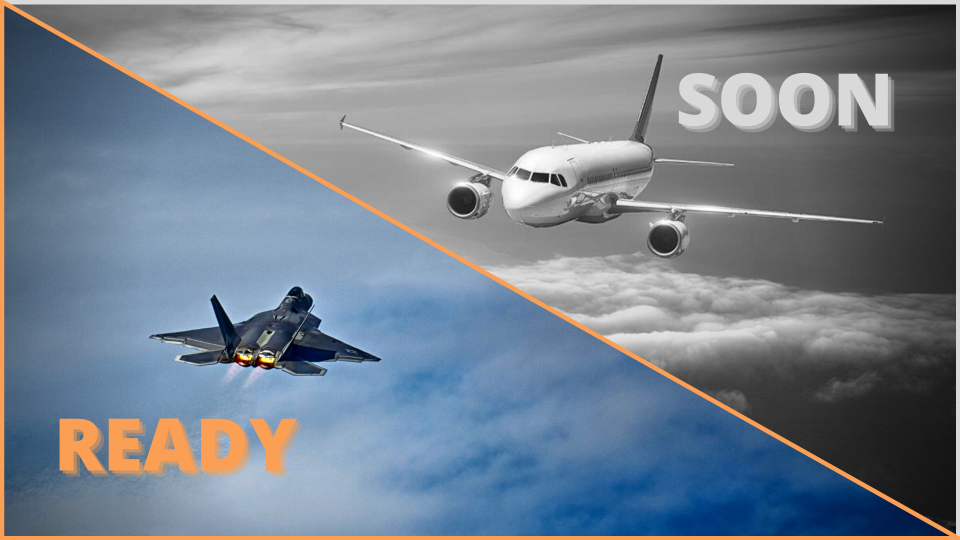

# Сivil Aviation

The second branch of development develops in parallel with the first. It includes the NFT collection of **civil aviation** from various countries.

<figure><figcaption></figcaption></figure>


The collection will consist of **7,777** unique civil aviation planes.


There will also be a very interesting game based on GameFi technology. A game called “Dispatcher”.&#x20;

In this game you have to carry out the takeoffs and landings of aircraft and prevent them from colliding. For each completed level you get in-game currency ([SVT Token](../products/svt-token.md)), which you can exchange for real money.

**In developing.**
