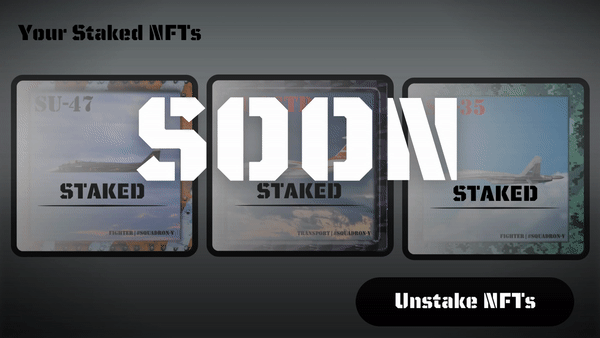

# Staking

## **Staking pool Squadron-V**

Staking in Squadron-V is available after the release of the second collection. Staking is implemented by **Cardinal**.

Cardinal is the best conditions for staking your NFT aircraft.

Staking is currently in the process of being **tested**.

By freezing your NFT Aircraft on our platform, you will start receiving dividends. The more unique the aircraft, the more it will bring profit to its owner.


**Validity by time.**\
With us, you specify the duration or fixed expiration date under which the issued Airplane NFT will be revoked.


<figure><figcaption>
Staking on our website
</figcaption></figure>
